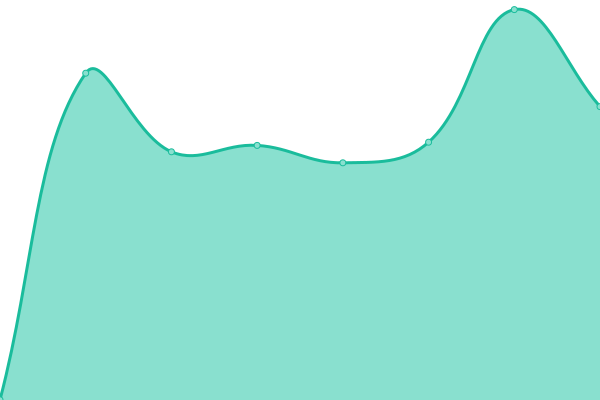

# [📈 Live Status](https://CERIT-SC.github.io/uptime): <!--live status--> **🟩 All systems operational**

This repository contains the open-source uptime monitor and status page for [CERIT Scientific Cloud](http://www.cerit-sc.cz/en/), powered by [Upptime](https://github.com/upptime/upptime).

With [Upptime](https://upptime.js.org), you can get your own unlimited and free uptime monitor and status page, powered entirely by a GitHub repository. We use [Issues](https://github.com/CERIT-SC/uptime/issues) as incident reports, [Actions](https://github.com/CERIT-SC/uptime/actions) as uptime monitors, and [Pages](https://CERIT-SC.github.io/uptime) for the status page.

<!--start: status pages-->
<!-- This summary is generated by Upptime (https://github.com/upptime/upptime) -->
<!-- Do not edit this manually, your changes will be overwritten -->
<!-- prettier-ignore -->
| URL | Status | History | Response Time | Uptime |
| --- | ------ | ------- | ------------- | ------ |
|  [CERIT-SC Rancher -- Kubernetes Management Portal](https://rancher.cloud.e-infra.cz) | 🟩 Up | [cerit-sc-rancher-kubernetes-management-portal.yml](https://github.com/CERIT-SC/uptime/commits/HEAD/history/cerit-sc-rancher-kubernetes-management-portal.yml) | 

 1096ms
     
 | 

<a href="https://status.cerit.io/history/cerit-sc-rancher-kubernetes-management-portal">100.00%</a>
    

|  [CERIT-SC Kubernetes Cluster -- Kuba Public](http://kuba-pub.cerit-sc.cz) | 🟩 Up | [cerit-sc-kubernetes-cluster-kuba-public.yml](https://github.com/CERIT-SC/uptime/commits/HEAD/history/cerit-sc-kubernetes-cluster-kuba-public.yml) | 

 465ms
     
 | 

<a href="https://status.cerit.io/history/cerit-sc-kubernetes-cluster-kuba-public">99.51%</a>
    

|  [CERIT-SC User Documentation](https://docs.cerit.io) | 🟩 Up | [cerit-sc-user-documentation.yml](https://github.com/CERIT-SC/uptime/commits/HEAD/history/cerit-sc-user-documentation.yml) | 

 227ms
     
 | 

<a href="https://status.cerit.io/history/cerit-sc-user-documentation">97.28%</a>
    

|  [CERIT-SC Container Registry -- cerit.io](https://cerit.io) | 🟩 Up | [cerit-sc-container-registry-cerit-io.yml](https://github.com/CERIT-SC/uptime/commits/HEAD/history/cerit-sc-container-registry-cerit-io.yml) | 

 561ms
     
 | 

<a href="https://status.cerit.io/history/cerit-sc-container-registry-cerit-io">100.00%</a>
    

|  [CERIT-SC Gitlab -- Git and CI/CD service](https://gitlab.ics.muni.cz) | 🟩 Up | [cerit-sc-gitlab-git-and-ci-cd-service.yml](https://github.com/CERIT-SC/uptime/commits/HEAD/history/cerit-sc-gitlab-git-and-ci-cd-service.yml) | 

 1049ms
     
 | 

<a href="https://status.cerit.io/history/cerit-sc-gitlab-git-and-ci-cd-service">100.00%</a>
    

|  [Zabbix Monitoring System](https://zabbix.cerit-sc.cz/) | 🟩 Up | [zabbix-monitoring-system.yml](https://github.com/CERIT-SC/uptime/commits/HEAD/history/zabbix-monitoring-system.yml) | 

 761ms
     
 | 

<a href="https://status.cerit.io/history/zabbix-monitoring-system">100.00%</a>
    

|  [Task Execution Service K8s -- TESK](https://tesk-prod.cloud.e-infra.cz/swagger-ui.html) | 🟩 Up | [task-execution-service-k8s-tesk.yml](https://github.com/CERIT-SC/uptime/commits/HEAD/history/task-execution-service-k8s-tesk.yml) | 

 1306ms
     
 | 

<a href="https://status.cerit.io/history/task-execution-service-k8s-tesk">100.00%</a>
    

|  [Workflow Execution Service K8s -- WES](https://wes-prod.cloud.e-infra.cz/ga4gh/wes/v1/ui/) | 🟩 Up | [workflow-execution-service-k8s-wes.yml](https://github.com/CERIT-SC/uptime/commits/HEAD/history/workflow-execution-service-k8s-wes.yml) | 

 1178ms
     
 | 

<a href="https://status.cerit.io/history/workflow-execution-service-k8s-wes">99.81%</a>
    

|  [Jupyter HUB](https://hub.cloud.e-infra.cz/) | 🟩 Up | [jupyter-hub.yml](https://github.com/CERIT-SC/uptime/commits/HEAD/history/jupyter-hub.yml) | 

 1380ms
     
 | 

<a href="https://status.cerit.io/history/jupyter-hub">99.71%</a>
    

|  [Binder HUB](https://binderhub.cloud.e-infra.cz/) | 🟩 Up | [binder-hub.yml](https://github.com/CERIT-SC/uptime/commits/HEAD/history/binder-hub.yml) | 

 2282ms
     
 | 

<a href="https://status.cerit.io/history/binder-hub">99.77%</a>
    

<!--end: status pages-->

[**Visit our status website →**](https://CERIT-SC.github.io/uptime)

## 📄 License

- Powered by: [Upptime](https://github.com/upptime/upptime)
- Code: [MIT](./LICENSE) © [CERIT Scientific Cloud](http://www.cerit-sc.cz/en/)
- Data in the `./history` directory: [Open Database License](https://opendatacommons.org/licenses/odbl/1-0/)
